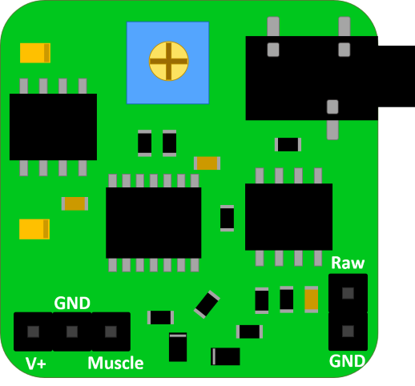

# EMG-826

## WARNING:
THIS IS NOT A MEDICAL DEVICE.
IMPROPER USE OF THIS SENSOR COULD CAUSE HARM TO THE SUBJECT.
YOU MUST BE INFORMED BEFORE USING IT. DON'T TAKE RISKS.
READ THE MANUAL AND DON'T HESITATE TO ASK QUESTIONS.

## Description: 
In this repository you will find example codes to use you board.

Stop complaining about using libraries, you don't need them: just plug and play!

EMG-826 it's a sEMG (surface Electromyography) sensor fully compatible with:

* Arduino
* ST
* PIC
* MSP430
* and more...

It has a varible resistor to amplify the output signal (Muscle pin). If you are curious about how a pure EMG signal looks, it has the Raw pin wich can be attached to an oscilloscope to see the pure signal.
There's no need to use dual voltage supply thanks to it's IC that converts single to dual supply. 
If you want to use it with an Arduino board just connect 5V to the V+ pin and GND to GND pin. For the Raw signal you can supply up to 9V on the V+ pin.

