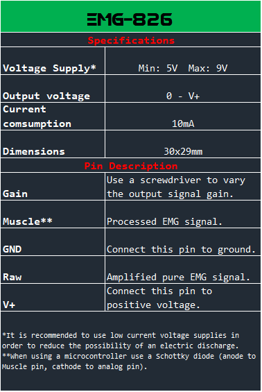

# EMG-826 
#### ***Know your strength!!!*** :muscle:

It looks like your QR scanner worked perfectly. Enjoy this repository!

To have a better visualization experience use your :computer:

## :warning: WARNING :warning:
THIS IS NOT A MEDICAL DEVICE.
IMPROPER USE OF THIS SENSOR COULD CAUSE HARM TO THE SUBJECT.
DO NOT IGNORE ANY OF THE INSTRUCTIONS GIVEN.

YOU MUST BE INFORMED BEFORE USING IT. DON'T TAKE RISKS.
READ THE MANUAL AND DON'T HESITATE TO ASK QUESTIONS. 


## Description

In this repository you will find example [codes](codes/) to use your board.

EMG-826 it's a [sEMG](https://www.ncbi.nlm.nih.gov/pmc/articles/PMC3821366/) (surface Electromyography) sensor fully compatible with:

* Arduino
* ST
* PIC
* MSP430
* and more...

It has a variable resistor (Gain) to amplify the output signal (Muscle pin). If you are curious about how a pure EMG signal looks, it has the Raw pin which can be attached to an oscilloscope.
There's no need to use dual voltage supply thanks to it's IC that converts single to dual supply.




## Muscle connections 

Read this: [Muscles of the Arm and Hand](https://doctorlib.info/anatomy/classic-human-anatomy-motion/7.html#:~:text=MUSCLE%20DIAGRAM)


### Electrodes

      

Choose a muscle and make sure your skin is dry and clean. Put one electrode **(red)** in the middle of the muscle and another one at the end **(blue)**, put a third electrode **(black)** in a bony zone (e.g. elbow).

## EMG-826 + Arduino

To connect the sensor to your Arduino you just need to follow the instructions in every [code](codes/). You can use the image below as reference to make the appropriate connections. **Do not forget to connect the [1N5819](https://www.mouser.mx/datasheet/2/308/1N5817-D-1801388.pdf) Schottky Diode.**

### Diode diagram


### Arduino Connections


You can begin to use this sensor by uploading this [code](codes/Plot_Muscle/Plot_Muscle.ino) below:


```C++
/*After uploading this code, type this commmand on your keyboard: ctrl + shift + L to
visualize your muscle's activity.*/

int Muscle; //Declare this variable to store analog read.

void setup() {
  Serial.begin(9600); //Begin serial communication.
}

void loop() {
  Muscle = analogRead(A0); //Here A0 was chosen but you can choose any analog channel.
  Serial.println(" ");
  Serial.print(440);       //Select a value between 0-1023
  Serial.print(" ");
  Serial.print(0);    
  Serial.print(" ");
  Serial.println(Muscle); //Red signal
}
```
## EMG-826 + Oscilloscope

This sensor has a wide voltage supply range (5-9V). If you want to know how your raw EMG signal looks like, follow this image below:


## Videotutorial

To learn more about this sensor and its aplications, go watch the tutorial below:

[EMG-826 tutorial]()
